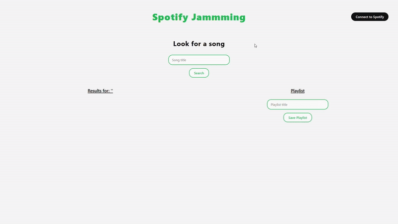

# Spotify Jammming
[](https://github.com/LuisKaizen75/jammming/actions/workflows/deploy.yml)

A personal portfolio project by [LuisKaizen](https://www.luiskaizen.com), **Spotify Jammming** is a modern React web app that lets you search for songs using the Spotify API, build custom playlists, and save them directly to your Spotify account.

---

## 🎥 Preview

▶️ YouTube: [Watch the demo](https://www.youtube.com/watch?v=CbvkKCQM6is)



---

## 🚀 Live Demo

The app is deployed at:  
👉 [www.luiskaizen.com/jammming/](https://www.luiskaizen.com/jammming/)

> **Note:**  
> This app uses Spotify’s developer API, which limits access to approved users.  
> To request access and test the full functionality, please contact me at [hola@luiskaizen.com](mailto:hola@luiskaizen.com).

---

## ✨ Features

- 🔐 **Spotify Authentication** – Secure login using Spotify OAuth with PKCE.
- 🔎 **Song Search** – Find tracks by title.
- 🎵 **Playlist Builder** – Add or remove tracks to build your own playlist.
- 💾 **Save to Spotify** – Save your playlist directly to your Spotify account.
- ⚛️ **Modern React Stack** – Built with React, Vite, and functional components.
- 🤖 **Automated Workflow** – GitHub Actions handles linting, testing, and deployment on every push to `main`.

---

## 🧪 Getting Started

To run this project locally:

```bash
git clone https://github.com/LuisKaizen75/jammming.git
cd jammming
npm install
npm run dev
```

## 🔐 Environment Variables
Create a .env file in the root directory with your Spotify credentials:

``` env
VITE_SPOTIFY_CLIENT_ID=your_client_id
VITE_SPOTIFY_REDIRECT_URI=http://127.0.0.1:5173
```
You’ll need to register a Spotify app in the [Spotify Developer Dashboard](https://developer.spotify.com/dashboard) and whitelist the redirect URI you’re using locally.

## 🛠️ Tech Stack
- [React](https://react.dev/)
- [Vite](https://vitejs.dev/)
- [Spotify Web API](https://developer.spotify.com/documentation/web-api/)
- [GitHub Actions](https://github.com/features/actions) for CI/CD

## 📄 License

MIT License

---

*This project is part of my personal portfolio. Feel free to reach out for collaboration or feedback!*